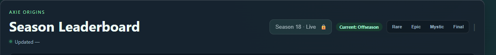
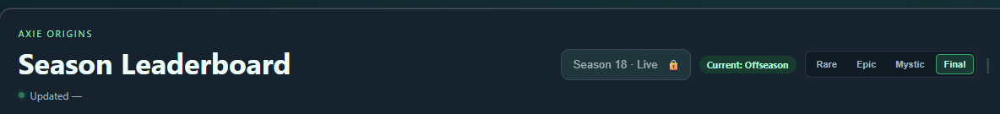

# Axie Echelon

Axie Echelon is a full-stack Axie Origins leaderboard analysis dashboard. It
turns leaderboard, battle-history, team, rune, and gene data into a focused
local experience for browsing ranked players, investigating team composition,
and running long-lived rune or body-part scans.

The project is intentionally built around real integration constraints:
upstream rate limits, incomplete data, asynchronous work, stale responses,
and the difference between a current leaderboard and historical season eras.

## Current and historical leaderboard views



*Automatic offseason mode: `Current: Offseason` identifies the active source
without turning Offseason into a fifth era tab.*



*Historical Final view: Final is selected while `Current: Offseason` remains
available for returning to the automatic leaderboard.*

## What it does

- Browse the top-ranked player pool with rank, name, and activity filters.
- Switch between the automatic current leaderboard and reached historical
  season eras. During offseason, the current source is distinct from Final
  rather than being treated as a fake fifth era.
- Scan the top-ranked pool for one or more runes or body parts, with progress,
  partial results, cancellation, and terminal job states. Historical tabs scan
  accepted local captured-team evidence only; they never use live enrichment.
- Combine rune and body-part scans correctly: selections within a filter use
  **OR** semantics, while rune and body-part filters intersect with **AND**
  semantics.
- Inspect enriched team previews, rune metadata, player profiles, and morphed
  Axies.
- Look up individual Axies or Ronin addresses, including collectible-aware
  filtering and paginated results.

> Activity labels are estimates derived from completed ranked battles and
> timing patterns. They do not claim to confirm a player is currently in a
> live match.

## Engineering highlights

| Real-world concern | Approach in Axie Echelon |
| --- | --- |
| Current vs. historical data | Explicit leaderboard scopes keep automatic offseason data separate from `Rare`/`Epic`/`Mystic`/`Final` history. |
| API pressure | In-memory candidate, page, team, profile, and enrichment caches reduce repeated upstream work. |
| Long scans | Rune and body-part filtering use asynchronous jobs with queueing, progress polling, cancellation, partial results, and watchdog timeouts. |
| Race conditions | Scope keys and generation guards prevent old leaderboard or scan responses from overwriting newer UI state. |
| Incomplete upstream data | The UI distinguishes confirmed results, unavailable data, and partial scan coverage instead of silently treating them as matches. |
| Rendering cost | PIXI/Spine morph rendering uses bounded concurrency and per-gene reuse. |

## Architecture

```text
Sky Mavis REST + GraphQL APIs
             |
             v
  Express API and service layer
  - scope-aware leaderboard routes
  - cached candidate and enrichment data
  - asynchronous scan jobs
             |
             v
  Vanilla JavaScript + Vite frontend
  - historical/current scope controls
  - polling, filter state, stale-response guards
  - PIXI/Spine team and Axie rendering
```

### Leaderboard scopes

The UI keeps the automatically resolved current state separate from a manual
historical selection:

| View | Data source | Stable scope key |
| --- | --- | --- |
| Current Rare/Epic/Mystic/Final | `/origins/v2/season-leaderboards?milestone=N` | `season:<seasonId>:milestone:<N>` |
| Current Offseason | `/origins/v2/leaderboards` | `offseason:<seasonId>` |
| Manually selected historical era | Accepted local snapshot, or “Snapshot unavailable” | `season:<seasonId>:milestone:<N>` |

This prevents Final-era cache entries, in-flight requests, and scan-job
deduplication from bleeding into offseason data. A manually selected historical
era reads its frozen candidate rows and captured teams from the same accepted
local snapshot; it never substitutes an upstream leaderboard or live team.
Historical rune/body-part filters use that same local evidence, so a missing
captured team is an unknown non-match rather than a live fallback.

## Technology

- **Frontend:** vanilla JavaScript, Vite, plain CSS, PIXI.js, Spine runtime
- **Backend:** Node.js ES modules and Express
- **Data integration:** Sky Mavis REST and GraphQL APIs
- **Testing:** Node's built-in test runner with deterministic fixtures and
  fetch adapters
- **Persistence:** live in-memory caches plus browser `sessionStorage`; optional
  immutable historical snapshots are stored locally under gitignored
  `data/snapshots/`

## Run locally

### Prerequisites

- Node.js 20+
- A Sky Mavis API key for live upstream requests

### Setup

```powershell
npm install
Copy-Item .env.example .env
# Add AXIE_ECHELON_API_KEY to your ignored .env file.
npm run dev
```

Open `http://127.0.0.1:5173`.

The Vite frontend runs on port `5173`; the Express API runs on port `8787`.
Never commit `.env` files, API keys, or raw API captures. See
[SECURITY.md](SECURITY.md) for publication guidance.

## Quality checks

```powershell
npm test
npm run build
git diff --check
```

The automated suite covers era boundaries, current/offseason routing,
scope-separated caches and scan-job deduplication, retries, progress and
cancellation lifecycle states, rune/body-part filter semantics, stale-response
protection, and archival snapshot safety. Historical row and team views use
only an explicitly accepted, era-bounded local snapshot; they never silently
fall back to current upstream leaderboard or team data.

## CI and snapshot safety

GitHub Actions validates the project using the repository's synthetic test and
build suite on pushes and pull requests to `main`. The CI workflow does not
read local snapshot artifacts, does not upload ignored `data/snapshots/`
content, and does not expose `.env`, credentials, or API keys. Real local
snapshot storage remains gitignored and operator-managed outside version
control.

## Project structure

```text
src/
  leaderboard/       Current/historical scope UI, filters, renderers, polling
  axieLookup/        Axie and Ronin address lookup experience
  server/            Routes, API clients, caches, scan jobs, concurrency
  data/              Season, rune, card, and mapping metadata
docs/
  implementation/    Data-flow and feature notes
  planning/          Architecture and roadmap decisions
server.js             Express entry point
vite.config.js        Frontend dev server and API proxy
```

## Design decisions worth discussing

- **No invented offseason milestone.** Offseason is a different upstream
  leaderboard source, not `milestone=5`.
- **Progressive historical navigation.** The UI only exposes season eras that
  have already been reached; offseason exposes all four as history.
- **Truthful async states.** `complete`, `partial`, `failed`, and `cancelled`
  mean different things and are surfaced rather than collapsed into a generic
  success state.
- **Scoped, not global, cache identity.** Candidate chunks, in-flight work,
  average match estimates, and job deduplication are keyed by leaderboard
  scope; user/team data remains user-scoped where appropriate.
- **Heuristics remain labeled as heuristics.** Battle timing is useful context,
  not a claim of real-time player presence.

## Current limitations and next steps

- Add comprehensive browser-level smoke coverage for the leaderboard and
  lookup flows.
- Enable the documented local end-of-era scheduler only when you are ready to
  capture private snapshot artifacts; it is off by default and still requires
  manual review/acceptance. See
  [snapshot archival](docs/implementation/snapshot-archival.md).
- Investigate the intermittent live-mode page reload behavior.
- Consider resumable scan jobs for requests that reach the watchdog timeout.
- Split the PIXI/Spine bundle further to reduce initial load cost.
- Add a public demo or a clearly labeled fixture-backed demo mode for portfolio
  viewing without exposing credentials.

## Further reading

- [Project handoff and current status](PROJECT_HANDOFF.md)
- [Rune scan job architecture](docs/planning/rune-scan-job-architecture.md)
- [Body-part filtering design](docs/implementation/body-part-filtering.md)
